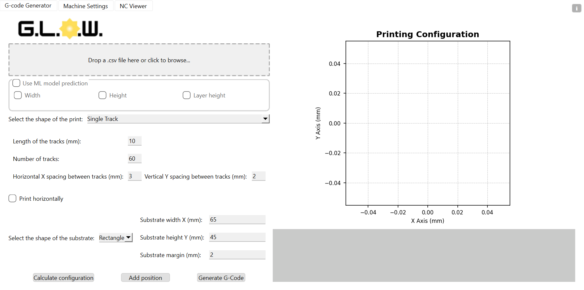
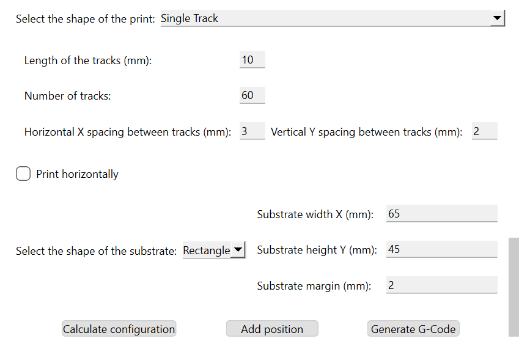
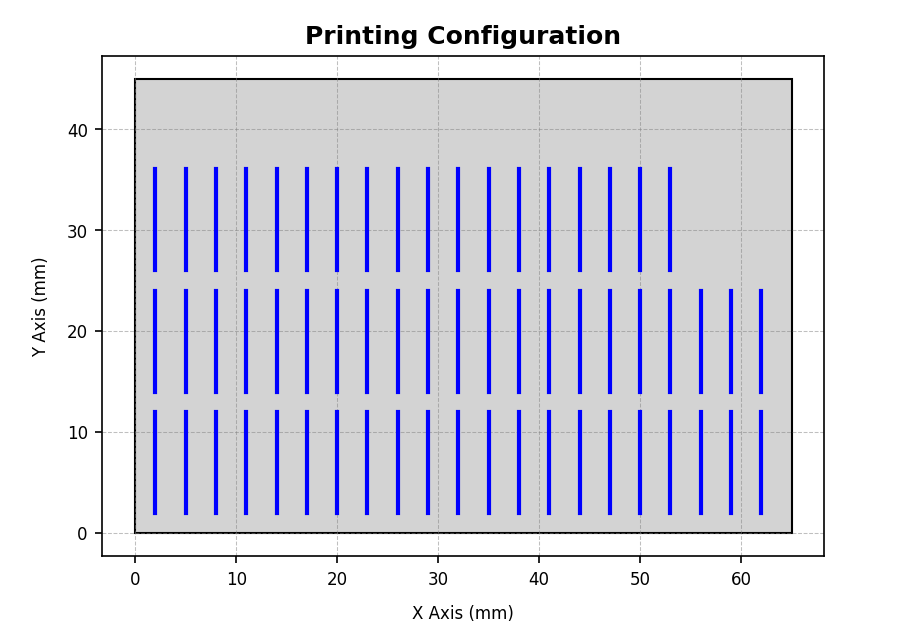
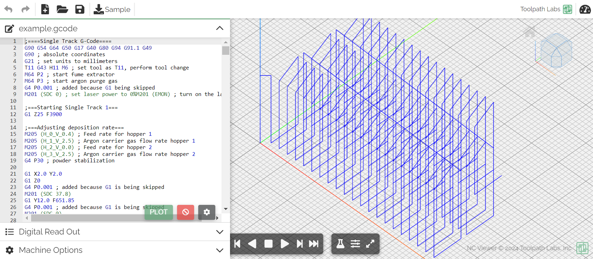

[](LICENSE)
[](https://www.python.org/downloads/)

> G-Code generator for Direct Energy Deposition additive manufacturing

## Table of Contents

- [Features](#features)
- [Installing the App](#installing-the-app)
- [Running the Source Code](#running-the-source-code)
- [Using G.L.O.W.](#using-glow)
- [Authors & Contributors](#authors--contributors)
- [License](#license)

<hr>

# G.L.O.W.

## Features

1. **Different printing shapes and substrates**
    - Supports single tracks, thin walls and cubes printing shapes.
    - Supports rectangular and circular substrates.

2. **Easy visualization**
    - Offers easy visualization of printing configuration.
    - Enables visualization of GCODE result with integrated [NC Viewer](https://ncviewer.com/).

3. **Flexible configurations**
    - Provides intuitive and easy parameter configuration for various applications.
    - Supports customized CNC machine specific codes within its application.

4. **Machine learning prediction model**
    - Provides machine learning model for geometry prediction, using the code from [xshang93/AIDED](https://github.com/xshang93/AIDED).

5. **Camera compatibility**
    - Allows camera integration for process monitoring.

<hr>

# Getting Started

## Installing the App

To install G.L.O.W. app you can:

1. Download [`glow_1.0_setup.exe`](glow_1.0_setup.exe) from the repository and run the installer (no repository cloning required) or

2. Clone the repository and follow [`glowapp.ipynb`](glowapp.ipynb) instructions (allows for customization in code).

<br/>

## Running the source code

To run the source code, you should clone the repository into your machine and open the directory.

```bash
git clone https://github.com/ArthurJWH/GLOW.git
```

From there, it is recommended to create a [virtual environment](https://docs.python.org/3/library/venv.html) and install the requirements as such:

```bash
pip install -r requirements.txt
```

After installing the packages, you can run the code in [`src/main.py`](src/main.py).

Alternatively, you can execute:

```bash
pip install -e .
```

This will allow you to run the code with `glow` command in the terminal.

<br/>

## Using G.L.O.W.

To generate the GCODE it is required a CSV file with some printing parameters, such as [example](docs/example/example.csv).

|   idx |   laser_power |   scanning_speed |   rpm_1 |   rpm_2 |   width |   height |   hatch_spacing |
|------:|--------------:|-----------------:|--------:|--------:|--------:|---------:|----------------:|
|     1 |         37.8  |           651.85 |     0.4 |       0 | 1.00199 | 0.342144 |             0.3 |
|     2 |         38.75 |           242.9  |     0.4 |       0 | 1.00199 | 0.342144 |             0.3 |
|     3 |         40.7  |           693.55 |     0.4 |       0 | 1.00199 | 0.342144 |             0.3 |
|     4 |         32.55 |           358.75 |     0.4 |       0 | 1.00199 | 0.342144 |             0.3 |
|     5 |         52.45 |           349.15 |     0.4 |       0 | 1.00199 | 0.342144 |             0.3 |
| ...   | ...           | ...              | ...     | ...     | ...     | ...      | ...             |

After opening the App, drop or select the CSV file into the upload box.



Follow the left column to input the geometric parameters.



Pressing `Calculate positions` should display the resulting configuration on the plot.



If satisfied, press `Generate G-Code` to generate the [GCODE](docs/example/example.gcode)

<!--  -->


> For more detailed and specific informations read the [Documentation](docs/info.md) or use the information button in the top-right corner of the GUI.

<hr>

# Authors & Contributors

**Author** : [Arthur Jiun Wei Hwang](https://github.com/ArthurJWH)

**Contact** : [arthurjwhwang@gmail.com](mailto:arthurjwhwang@gmail.com)

**Contributors** : Ajay Talbot, Xiao Shang, Hyun Suk Choi

## License

This project is licensed under the MIT License - see the [LICENSE](LICENSE) for details.